# How to Make Strand-Based Hair Rendering Fast

<video style="max-width: 66rem; width: 100%;" controls src="./assets/26-01-15_14-54-05.mp4" title="100k16R7P10G"></video>

Strand-based hair rendering is one of those techniques that looks deceptively simple on paper but quickly becomes a performance nightmare at scale. Unlike shell-based or card-based approaches where hair is faked with textured surfaces, strand-based rendering treats each hair as an individual curve, giving you realistic motion, proper silhouettes, and physically-based lighting. The cost? You're now dealing with tens of thousands of tiny primitives, each needing physics simulation every frame.

The solution used by production systems like AMD TressFX and Frostbite's hair pipeline is guide strand interpolation:

- **Guide strands**: A small subset (5-10%) of strands that receive full physics simulation. These act as "skeleton" curves that define how the hair moves.
- **Interpolated strands**: The remaining 90-95% of strands. Instead of simulating physics, they blend their positions from nearby guides at render time.

In this post, I'll walk through my complete rendering pipeline that I implemented for the PS5: generating strands on a mesh, spatially sorting them for efficient guide assignment, tessellating curves into renderable geometry, and shading with Kajiya-Kay's anisotropic lighting model.

The pipeline at a glance:

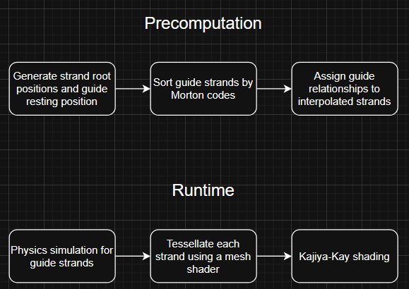

## Generating Strand Root Positions and Guide Resting Positions

To distribute my strands I decided I want to randomly place them on the surface of my mesh, to do this I first select a random triangle on the mesh and then randomly place the strand inside that triangle. To ensure larger triangles receive proportionally more hair strands we can use a cumulative distribution function based on the triangle areas:

```cpp
const auto cumulativeAreas = static_cast<float*>(m_cumulativeAreasBuffer.getDataAddress());
for (size_t i = 0; i < triangleCount; ++i)
{
    const auto indexBuffer = static_cast<uint16_t*>(m_indexBuffer.getDataAddress());
    const auto i0 = indexBuffer[i * 3 + 0];
    const auto i1 = indexBuffer[i * 3 + 1];
    const auto i2 = indexBuffer[i * 3 + 2];

    const auto vertexBuffer = static_cast<vec3*>(m_positionBuffer.getDataAddress());

    cumulativeAreas[i] = triangleArea(vertexBuffer[i0], vertexBuffer[i1], vertexBuffer[i2]);
}

for (size_t i = 1; i < triangleCount; ++i)
    cumulativeAreas[i] = cumulativeAreas[i] + cumulativeAreas[i - 1];

const float totalArea = cumulativeAreas[triangleCount - 1];
for (size_t i = 0; i < triangleCount; ++i)
    cumulativeAreas[i] /= totalArea;
```

This gives us a lookup table where each triangle "owns" a range proportional to its area. To sample a random triangle we generate a random float between 0 and 1 and find which triangles range that float falls into, larger triangles have wider ranges, so they're selected more often.

After computing this cumulative areas buffer I dispatch a compute shader for each one of my strands. In this shader I compute my `strandData` for each strand and `guideVertex` for each guide strand vertex that look like this:

```cpp
struct strandData
{
    float3 rootPosition;
    float3 normal;
    float3 tangent;
    float3 bitangent;
};

struct guideVertex
{
    float3 position;
    float3 prevPosition;
    float3 restPosition;
};
```

After selecting a random triangle using the cumulative distribution function we generate a random barycentric coordinate and interpolate the triangle's position, and normal. I also generate a tangent and a bitangent for each strand.

```cpp
float u = randomFloat(seed);
float v = randomFloat(seed);

if (u + v > 1.0)
{
    u = 1.0 - u;
    v = 1.0 - v;
}

float w = 1.0 - u - v;

float3 localRootPos = w * v0 + u * v1 + v * v2;
float3 localNormal = normalize(w * n0 + u * n1 + v * n2);
float3 ref = abs(localNormal.y) < 0.999f ? float3(0, 1, 0) : float3(1, 0, 0);
float3 localTangent = normalize(cross(ref, localNormal));

float3 localBitangent = normalize(cross(localNormal, localTangent));

strandDataBuffer[dispatchThreadID].rootPosition = localRootPos;
strandDataBuffer[dispatchThreadID].normal = localNormal;
strandDataBuffer[dispatchThreadID].tangent = localTangent;
strandDataBuffer[dispatchThreadID].bitangent = localBitangent;
```

The normal vector represents my Y+ axis, the tangent my X+ axis and the bitangent my Z+ axis for my strand space representation where the origin is the root position of the strand.

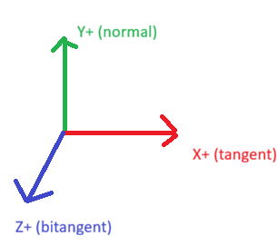

Guide strands need an initial rest shape meaning the pose they try to return to during physics simulation, these vertex positions are in strand space. Rather than starting perfectly straight, I add a natural droop where strands gradually curve downward toward their tips:

```cpp
if (dispatchThreadID % srt->guideStride == 0)
{
    const float3 modelDown = float3(0, -1.f, 0);
    const float3 strandSpaceDown = float3
    (
        dot(modelDown, localTangent),
        dot(modelDown, localNormal),
        dot(modelDown, localBitangent)
    );

    float3 currentPos = float3(0, 0, 0);

    for (int i = 1; i < srt->segmentsPerStrand + 1; i++)
    {
        float t = float(i) / float(srt->segmentsPerStrand);
        float droopFactor = t * t * 0.3f; // droop strength

        float3 dir = normalize(lerp(float3(0, 1.f, 0), strandSpaceDown, droopFactor));
        currentPos += dir * segmentLength;

        guideVerticesBuffer[rootIndex + i].position = currentPos;
        guideVerticesBuffer[rootIndex + i].prevPosition = currentPos;
        guideVerticesBuffer[rootIndex + i].restPosition = currentPos;
    }
}
```

## Sort Guide Strands Using Morton Codes and Assign Guide Relationships

Because we want to interpolate between the two nearest strands for each strand we first need to find which 2 guide strands are the closest to each individual strand. To do this we construct a [Z-order curve](https://en.wikipedia.org/wiki/Z-order_curve). We generate a morton code for each guide strands root position using this function:

```cpp
uint64_t Hair::SpreadBits3D(const uint32_t v) const
{
    uint64_t x = v & 0x1fffff;  // Only use 21 bits (3 * 21 = 63 bits fits in uint64)
    x = (x | x << 32) & 0x1f00000000ffff;
    x = (x | x << 16) & 0x1f0000ff0000ff;
    x = (x | x << 8) & 0x100f00f00f00f00f;
    x = (x | x << 4) & 0x10c30c30c30c30c3;
    x = (x | x << 2) & 0x1249249249249249;
    return x;
}

uint64_t Hair::EncodeMorton3D(const uint32_t x, const uint32_t y, const uint32_t z) const
{
    return SpreadBits3D(x) | (SpreadBits3D(y) << 1) | (SpreadBits3D(z) << 2);
}

uint64_t Hair::PositionToMorton(const vec3& pos, const vec3& bbMin, const vec3& bbMax) const
{
    const vec3 normalized = (pos - bbMin) / (bbMax - bbMin);

    constexpr uint32_t GRID_SIZE = (1u << 21) - 1;

    const uint32_t x = static_cast<uint32_t>(normalized.x * GRID_SIZE);
    const uint32_t y = static_cast<uint32_t>(normalized.y * GRID_SIZE);
    const uint32_t z = static_cast<uint32_t>(normalized.z * GRID_SIZE);

    return EncodeMorton3D(x, y, z);
}
```

This gives us a single integer that preserves spatial locality meaning the closer two numbers are the closer they are in 3D space. After sorting all strands by their Morton code, spatially nearby strands become adjacent in the array. This makes guide selection trivial:

```cpp
InterpolationData Hair::FindTwoNearestGuides(const uint64_t queryMorton,
    const vec3& queryRootPos,
    const std::vector<GuideSearchEntry>& sortedGuides,
    const StrandData* strandData) const
{
    InterpolationData result{};

    const auto it = std::lower_bound(sortedGuides.begin(),
                                     sortedGuides.end(),
                                     queryMorton,
                                     [](const GuideSearchEntry& entry, const uint64_t code)
                                     {
                                         return entry.mortonCode < code;
                                     });

    const size_t insertId = std::distance(sortedGuides.begin(), it);

    constexpr int checkedNeighborsCount = 12;

    std::vector<std::pair<float, uint32_t>> candidates;  // (distance, guideIndex)
    candidates.reserve(2 * checkedNeighborsCount + 1);

    for (int offset = -checkedNeighborsCount; offset <= checkedNeighborsCount; ++offset)
    {
        const int id = static_cast<int>(insertId) + offset;

        if (id < 0 || id >= static_cast<int>(sortedGuides.size())) continue;

        const GuideSearchEntry& guide = sortedGuides[id];
        vec3 guideRootPos = strandData[guide.originalStrandIndex].rootPosition;
        float dist = distance(queryRootPos, guideRootPos);

        candidates.emplace_back(dist, guide.guideIndex);
    }

    std::sort(candidates.begin(), candidates.end(), [](const auto& a, const auto& b) { return a.first < b.first; });

    result.guideIndex0 = candidates[0].second;
    result.guideIndex1 = candidates[1].second;

    const float d0 = candidates[0].first;
    const float d1 = candidates[1].first;

    result.weight0 = d1 / (d0 + d1);
    result.isGuide = 0;

    return result;
}
```

This function is called on each interpolation strand to provide us with the needed information to be able to interpolate between guide strands at runtime:

```cpp
struct InterpolationData
{
    uint32_t guideIndex0;
    uint32_t guideIndex1;
    float weight0;
    uint32_t isGuide;
};
```

## Physics Simulation

I won't go too into detail about my physics simulation as this is not the focus of this blog post, but here is a high level overview. I dispatch a compute shader that is one thread per guide strand. Firstly I need to convert all my guide vertex positions into world space since I will be doing all my physics simulation in world space and then converting the data back into strand space after the simulation.

```cpp
float3 StrandToWorld(float3 localPos, float3 worldRoot, float3 T, float3 N, float3 B)
{
    return worldRoot + T * localPos.x + N * localPos.y + B * localPos.z;
}

for (uint i = 1; i <= srt->segmentsPerStrand; ++i)
{
    guide_vertex v = guideVerticesBuffer[strandStartIndex + i];
    v.position = StrandToWorld(v.position, worldRoot, worldT, worldN, worldB);
    v.prevPosition = StrandToWorld(v.prevPosition, prevWorldRoot, prevWorldT, prevWorldN, prevWorldB);
    v.restPosition = StrandToWorld(v.restPosition, worldRoot, worldT, worldN, worldB);
    guideVerticesBuffer[strandStartIndex + i] = v;
}
```

I used Verlet integration which is a simple and stable method of physics simulation where velocity is implicit in the difference between current and previous positions.

```cpp
float3 force = float3(0.0, -9.81, 0.0) * srt->gravityStrength + 
               windForce + swayForce +
               stiffnessForce;

float decay = exp(-srt->damping * srt->deltaTime);
auto currentPos = vertex.position;
vertex.position += decay * (vertex.position - vertex.prevPosition) + force * srt->deltaTime * srt->deltaTime;
vertex.prevPosition = currentPos;
```

The final position equation is `float3 newPosition = position + damping * velocity + acceleration * dt * dt;`

As you can see I implemented gravity, a wind force that has a sinusoidal sway and some gust noise, as well as the stiffness force which tries to force back the strand to its rest position. I can set the stiffness at my root and my tip and I interpolate between these values based on what segment I'm simulating. I also run several constraint iterations for length to keep the strands at a consistent length and also collision constraints to collide with capsules that can be placed per model. After all constraints are solved, I transform the positions back to strand-local space for storage using the inverse operation.

If you want to look deeper into physics simulation of hair strands I recommend checking out [TressFX's implementation](https://github.com/GPUOpen-Effects/TressFX/blob/master/src/Shaders/TressFXSimulation.hlsl) as my implementation was heavily inspired by it as well.

## Tessellation Using Mesh Shaders

Hair rendering often uses compute shaders to expand control points into renderable geometry.
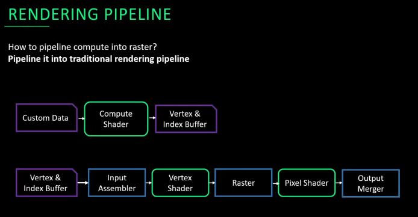
 Because I was working on the PS5 I had the opportunity to use mesh shaders, mesh shaders offer a more flexible and efficient approach. Mesh shaders combine the functionality of vertex and geometry shaders into a single programmable stage, giving us explicit control over how work is distributed across threads.
 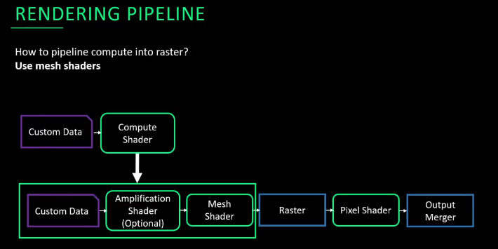

The core idea is simple: each guide strand stores only its control point positions in strand space from physics simulation. At render time, we subdivide these into smooth curves using [Catmull-Rom spline interpolation](https://qroph.github.io/2018/07/30/smooth-paths-using-catmull-rom-splines.html), then expand each segment into a camera-facing quad.

I used centripetal parameterization (alpha = 0.5) which prevents cusps and self intersections that can occur with uniform parameterization. I also use a tension of 0 to create smooth curves

```cpp
float3 CatmullRom(float3 p0, float3 p1, float3 p2, float3 p3, float t)
{
    float t01 = pow(length(p1 - p0), ALPHA);
    float t12 = pow(length(p2 - p1), ALPHA);
    float t23 = pow(length(p3 - p2), ALPHA);

    const float3 m1 = (1.f - TENSION) * (p2 - p1 + t12 * ((p1 - p0) / t01 - (p2 - p0) / (t01 + t12)));
    const float3 m2 = (1.f - TENSION) * (p2 - p1 + t12 * ((p3 - p2) / t23 - (p3 - p1) / (t12 + t23)));

    return (2.f * (p1 - p2) + m1 + m2) * t * t * t +
        (-3.f * (p1 - p2) - m1 - m1 - m2) * t * t +
        m1 * t +
        p1;
}
```

Remember that we only simulate physics on guide strands. At render time, non guide strands need to derive their positions from nearby guides. This happens in this function:

```cpp
float3 EvaluateStrandPosition(uint strandIndex, uint rungIndex, srt::hair_srt* srt)
{
    interpolation_data interpData = interpolationDataBuffer[strandIndex];
    
    float3 pos0 = EvaluateGuidePosition(interpData.guideIndex0, rungIndex, srt);
    
    float3 interpolatedPos;
    if (interpData.isGuide == 1)
    {
        interpolatedPos = pos0;
    }
    else
    {
        float3 pos1 = EvaluateGuidePosition(interpData.guideIndex1, rungIndex, srt);
        interpolatedPos = lerp(pos1, pos0, interpData.weight0);
    }
    
    strand_data strandData = strandDataBuffer[strandIndex];
    return strandData.rootPosition + 
           strandData.tangent * interpolatedPos.x + 
           strandData.normal * interpolatedPos.y + 
           strandData.bitangent * interpolatedPos.z;
}
```

Each strand samples its two nearest guides at the same segment position (rungIndex), blends between them using the precomputed weights we precalculated, then transforms them from strand space to world space using the strands TBN vectors. This transformation is what makes strands follow the object they're attached to automatically.

Hair strands are essentially 1D curves, but we need to give them screen presence. The standard approach is to expand each point along the strand into a quad that always faces the camera:

```cpp
float3 centerPos = g_rungData[localRungIndex].position;
float3 tangent = g_rungData[localRungIndex].tangent;

float3 toCamera = normalize(srt->cameraPositionLocal - centerPos);
float3 right = normalize(cross(tangent, toCamera));

float sideOffset = (side == 0) ? -0.5f : 0.5f;
float3 localPos = centerPos + right * srt->hairWidth * sideOffset;
```

By taking the cross product of the tangent and the view direction, we get a vector perpendicular to both, which we use to offset vertices left and right of the strand center. This creates quads that are always maximally visible to the camera.

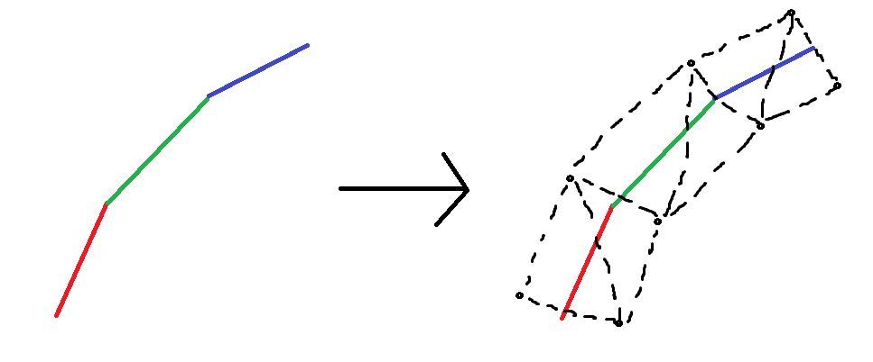

Mesh shaders let us share data between threads using thread group memory. After subdividing the strand, each strand is a series of sample points I call rungs. Since multiple threads need the same rung positions for tangent calculation, we compute them once and store them in shared memory:

```cpp
thread_group_memory rung_data g_rungData[NUM_THREADS / 2];

if (side == 0 && tid < output.vertCount)
{
    g_rungData[localRungIndex].position = EvaluateStrandPosition(globalStrandIndex, rungIndex, srt);
}

GroupMemoryBarrierWithGroupSync();

if (side == 0 && tid < output.vertCount)
{
    uint maxRung = srt->subdivisionsPerStrand - 1;
    uint baseRung = localStrandIndex * srt->subdivisionsPerStrand;
    
    float3 tangent;
    if (rungIndex == 0)
    {
        tangent = g_rungData[baseRung + 1].position - g_rungData[baseRung].position;
    }
    else if (rungIndex == maxRung)
    {
        tangent = g_rungData[baseRung + maxRung].position - g_rungData[baseRung + maxRung - 1].position;
    }
    else
    {
        tangent = g_rungData[baseRung + rungIndex + 1].position - g_rungData[baseRung + rungIndex - 1].position;
    }
    g_rungData[localRungIndex].tangent = normalize(tangent);
}
```

The barrier ensures all threads have finished writing before any thread reads. The tangent calculation uses central differences for interior points and forward/backward differences at the endpoints, giving us smooth tangent variation along the strand.

## Kajiya-Kay Shading

Hair doesn't behave like typical surfaces under light. A single hair fiber is essentially a cylinder, causing light to scatter anisotropically in a cone around the hair direction rather than reflecting like a mirror. The [Kajiya-Kay model](https://dl.acm.org/doi/pdf/10.1145/74334.74361) captures this behavior efficiently and remains widely used in real-time applications.

the Kajiya-Kay model is made up of a diffuse component which is derived from the Lambert shading model applied to a very small cylinder, and also a specular component that is similar to the Phong light reflection model that has been modified for cylindrical surfaces:

```cpp
float3 e = normalize(srt->camperaPos - input.position);
float TdotE = dot(t, e);
float sinTE = sqrt(max(0.0, 1.0 - TdotE * TdotE));

auto dirLight = srt->directional_lights[i];
float3 l = normalize(dirLight.direction);
float TdotL = dot(t, l);
float sinTL = sqrt(max(0.0, 1.0 - TdotL * TdotL));

float diffuse = srt->diffuseReflCoef * sinTL;
float specular = srt->specularReflCoef * pow(dot(t, l) * TdotE + sinTL * sinTE, srt->phongExponent);

finalColor += (srt->hairColor * diffuse + srt->hairSpecColor * specular) * dirLight.color * dirLight.intensity * 0.001f;
```

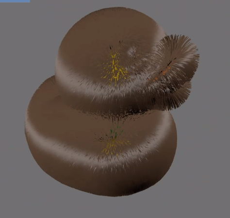

To break up the uniform specular highlight, I add per-strand noise to the tangent using a hash function from [this](https://www.shadertoy.com/view/XlGcRh) shader toy:

```cpp
float3 noiseOffset = (hashwithoutsine33(input.strandId * srt->tangentNoiseScale) - 0.5) * srt->tangentNoiseStrength;
float3 t = normalize(input.tangent + noiseOffset);
```

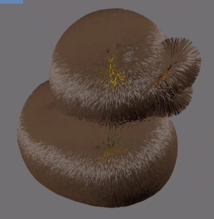

And for simple and cheap ambient occlusion, I darken strands near their roots where self shadowing would naturally occur:

```cpp
float aoFactor = lerp(srt->rootDarkening, 1.0, input.rungIndex);
finalColor *= aoFactor;
```

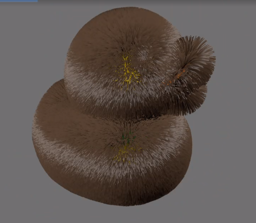

This is a crude approximation of proper deep opacity maps, but adds significant depth to the final render.

Here are some more examples of different diffuse and specular colors:

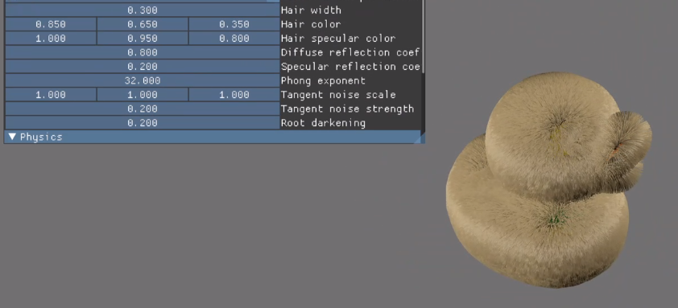

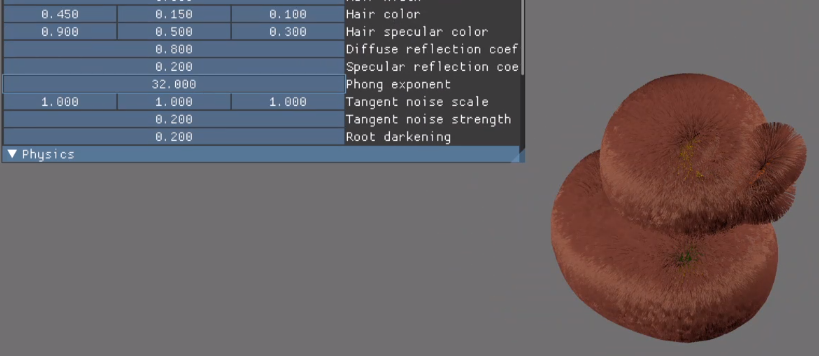

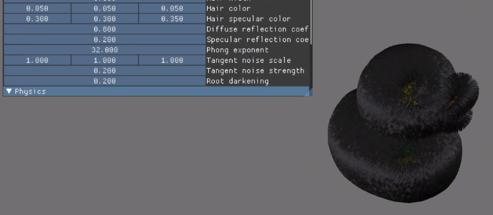

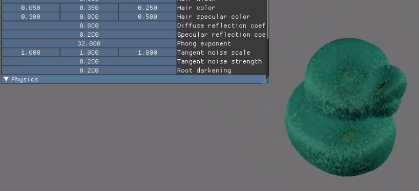

## Performance results

Because I set up my implementation in a way that it's super easy to change how many hair segments my guide strands have when doing physics simulation, how many segments the strands get divided into when tessellating the strands and how many guide strands there are per interpolation strand I can easily profile my performance gain by checking the difference in physics simulation and render times.

When I took a trace of rendering 100k strands with 7 segments for physics simulation, 15 segments when tessellating and a 1:1 ratio of guide strands, my physics shader ran for **5.75ms** and drawing my hair took **1.30ms**.

After this I changed the ratio of guide strands to 1:10 and my physics simulation time went down to **0.47ms** while drawing my hair took **1.70ms**. As expected physics simulation ran much faster since I went from simulating 100k strands to just 10k. However drawing my hair did go up since my mesh shader needed to do extra work when interpolating between the guide strand positions.

The visual difference between simulating all strands versus just 10% of them is barely perceptible showcased in the two videos below. The first one is simulating all the strands and the second one has a guide strand ratio of 1:10 strands.

<video style="max-width: 66rem; width: 100%;" controls src="./assets/26-01-15_15-02-03.mp4" title="All strands simulated"></video>

<video style="max-width: 66rem; width: 100%;" controls src="./assets/26-01-15_14-54-05.mp4" title="100k16R7P10G"></video>

## Conclusion

Building a strand-based hair rendering system involves balancing visual fidelity against computational cost at every stage. The guide strand interpolation approach which simulates only 10% of strands while interpolating the rest, delivered a 12x reduction in physics simulation time (5.75ms → 0.47ms) with only a modest 0.4ms increase in rendering cost. The visual difference is negligible, validating why this technique has become standard in production systems like TressFX and Frostbite's hair pipeline.

## Further improvements

- **Marschner shading model:** More physically accurate than Kajiya-Kay, modeling light paths through the hair fiber (R, TT, TRT components). Better for realistic hair where internal scattering matters.
- **Self-shadowing:** Opacity maps or deep shadow maps to capture how hair occludes itself.
- **Generate strands based on textures:** I could use textures to represent where on my mesh, what density and what color my hair strands are with a bunch of other parameters that could be changed based on textures.
- **Importable hair grooms:** Artists can make and export hair grooms which would represent the rest positions and other parameters per strand.
- **Dynamic LOD system:** I could implement an LOD system that changes the amount of rendered segments per hair strand based on distance as well as other LOD techniques for hair

## References

- [AMD TressFX](https://github.com/GPUOpen-Effects/TressFX/tree/master): AMD's strand based hair implementation

- [Robin Taillandier & Jon Valdes - Every Strand Counts: Physics and Rendering Behind Frostbite’s Hair](https://www.youtube.com/watch?v=ool2E8SQPGU): Presentation of Frostbite's strand based hair implementation

- [SIGGRAPH 2025 Advances: STRAND-BASED HAIR AND FUR RENDERING IN INDIANA JONES AND THE GREAT CIRCLE](https://www.youtube.com/watch?v=jSE1XXBEK-w): Presentation on the hair implementation in the new Indiana Jones game.

- [[Kajiya and Kay 1989] Rendering fur with three dimensional textures](https://dl.acm.org/doi/pdf/10.1145/74334.74361): Paper describing the Kajiya-Kay shading model I used.

- [Radosław Paszkowski - Mesh Shaders - The Future of Rendering](https://www.youtube.com/watch?v=3EMdMD1PsgY): Presentation on Mesh shaders.

- [Thinking Parallel, Part III](https://developer.nvidia.com/blog/thinking-parallel-part-iii-tree-construction-gpu/): NVIDIA Developer blogpost describing parallel tree construction on the GPU using Morton codes and Z-Order curves.

_Developed on PlayStation 5 as part of my studies at Breda University of Applied Sciences._